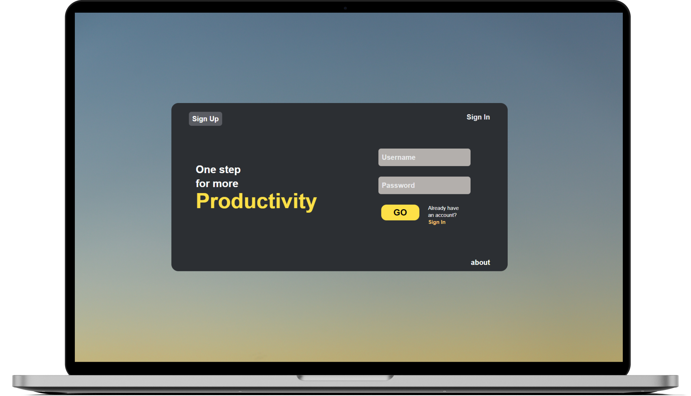

<h1 align="center">
  </img>
</h1>

<p align="center">
  <a href="#ℹ-description">Description</a> •
  <a href="#-demo">Demo</a> •
  <a href="#-technologies">Technologies</a> •
  <a href="#-how-to-use">How to use</a> •
  <a href="#-credits">Credits</a>
</p>

<p align="center">
  </img>
</p>

## ℹ Description

> This full stack application consists in a Kanban Board using **React**, **FastAPI** and **PosgreSQL**.

The app is able to make a user authentication and each user has their own
board which is saved on the database. More importantly it has the feature of drag an drop,
allowing to create columns and tasks. As a result, it's extremely customizable.

## 💻 Demo

### Board

<p align="center"></p>

### Login and Register

<p align="center"></p>

### Screenshots


## 🛠 Technologies

### REST API Swagger Docs With FastAPI


### Backend:

- [**FastAPI**](https://fastapi.tiangolo.com/)
- [**Tortoise-ORM**](https://tortoise-orm.readthedocs.io/en/latest/)
- [**Uvicorn**](https://www.uvicorn.org/)
- [**PyJWT**](https://pyjwt.readthedocs.io/en/stable/)
- [**Pydantic**](https://pydantic-docs.helpmanual.io/)
- [**PostgreSQL**](https://www.postgresql.org/)
- [**Adminer with Docker**](https://hub.docker.com/_/adminer)

_The requirements file shows everything you need to run it_

### Frontend:

- [**React**](https://reactjs.org/)
- [**React-router-dom**](https://reactrouter.com/)
- [**styled-components**](https://styled-components.com/)

_Others can be seen on the package.json file_

## 🖥 How to use

```bash
# clone this repo and access its folder
$ git clone https://github.com/andrevks/kaban-react-fastapi.git && cd kaban-react-fastapi

# Initiate backend
$ cd backend
$ uvicorn main:app --reload

# Initiate frontend
$ cd frontend
$ npm start run 
```

## 📚 Credits

The core of the application was done following the tutorial by the
[**Pretty Printed**](https://www.youtube.com/channel/UC-QDfvrRIDB6F0bIO4I4HkQ) YouTube channel.

---

<p align="center">Made with 💜 by <a href="https://github.com/andrevks">André Geraldo</a></p>
